# Diagram Architektury Modułu Autentykacji - MoneyFlowTracker

## Przegląd

Diagram przedstawia kompleksową architekturę modułu autentykacji aplikacji MoneyFlowTracker, obejmując komponenty UI (Angular 20 standalone), serwisy, guardy routingu, oraz integrację z Supabase Auth.

## Diagram Mermaid

```mermaid
flowchart TD
    %% ===== WARSTWA UŻYTKOWNIKA =====
    subgraph "Warstwa Użytkownika"
        USER["👤 Użytkownik"]
    end

    %% ===== WARSTWA ROUTINGU I GUARDS =====
    subgraph "Routing i Guards"
        ROUTER["Angular Router"]
        GUEST_GUARD["guestGuard<br/>(Functional)"]
        AUTH_GUARD["authGuard<br/>(Functional)"]
    end

    %% ===== STRONY PUBLICZNE =====
    subgraph "Strony Publiczne - guestGuard"
        LOGIN["LoginComponent<br/>📝 Formularz logowania"]
        REGISTER["RegisterComponent<br/>📝 Formularz rejestracji"]
        WELCOME["WelcomeComponent<br/>🏠 Strona powitalna"]
        PURCHASE["PurchaseComponent<br/>🛒 Strona zakupów"]
    end

    %% ===== STRONY CHRONIONE =====
    subgraph "Strony Chronione - authGuard"
        MAIN_LAYOUT["MainLayoutComponent<br/>🏛️ Główny layout"]
        EXPENSES["ExpensesPageComponent<br/>💰 Zarządzanie wydatkami<br/>(Lazy Loaded)"]
    end

    %% ===== WARSTWA SERWISÓW =====
    subgraph "Warstwa Serwisów Angular"
        AUTH_SERVICE["AuthService<br/>🔐 Zarządzanie autentykacją"]
        AUTH_STATE["authStateSignal<br/>📊 Stan: user, loading, error"]
    end

    %% ===== METODY AUTH SERVICE =====
    subgraph "Metody AuthService"
        INIT_AUTH["initializeAuth()<br/>Inicjalizacja sesji"]
        SIGN_IN["signIn(email, password)<br/>Logowanie"]
        SIGN_UP["signUp(email, password)<br/>Rejestracja"]
        SIGN_OUT["signOut()<br/>Wylogowanie"]
        ERROR_RESOLVER["resolveErrorMessage()<br/>Tłumaczenie błędów"]
    end

    %% ===== WARSTWA WALIDACJI =====
    subgraph "Walidacja Formularzy"
        VALIDATORS["Angular Validators<br/>✓ required, email, minLength"]
        CUSTOM_VALIDATOR["passwordMatchValidator<br/>✓ Dopasowanie haseł"]
    end

    %% ===== WARSTWA KLIENTA SUPABASE =====
    subgraph "Klient Supabase"
        SUPABASE_CLIENT["supabaseClient<br/>🔌 Singleton Instance"]
        AUTH_METHODS["Metody Auth:<br/>• getSession()<br/>• signInWithPassword()<br/>• signUp()<br/>• signOut()<br/>• onAuthStateChange()"]
    end

    %% ===== WARSTWA BACKENDU =====
    subgraph "Backend - Supabase"
        SUPABASE_AUTH["Supabase Auth API<br/>🔒 JWT Tokens, Sessions"]
        POSTGRES["PostgreSQL<br/>💾 Tabela auth.users"]
        STORAGE["localStorage<br/>💿 Token Storage"]
    end

    %% ===== PRZEPŁYW UŻYTKOWNIKA =====
    USER -->|"Wchodzi na stronę"| ROUTER

    %% ===== ROUTING - PUBLICZNY =====
    ROUTER -->|"/login"| GUEST_GUARD
    ROUTER -->|"/register"| GUEST_GUARD
    ROUTER -->|"/welcome"| WELCOME
    ROUTER -->|"/purchase"| PURCHASE
    
    GUEST_GUARD -->|"Niezalogowany: allow"| LOGIN
    GUEST_GUARD -->|"Niezalogowany: allow"| REGISTER
    GUEST_GUARD -->|"Zalogowany: redirect /app"| MAIN_LAYOUT

    %% ===== ROUTING - CHRONIONY =====
    ROUTER -->|"/app/*"| AUTH_GUARD
    AUTH_GUARD -->|"Zalogowany: allow"| MAIN_LAYOUT
    AUTH_GUARD -->|"Niezalogowany: redirect /login"| LOGIN
    
    MAIN_LAYOUT -->|"router-outlet"| EXPENSES

    %% ===== PRZEPŁYW LOGOWANIA =====
    LOGIN -->|"onSubmit()"| SIGN_IN
    LOGIN -.->|"Walidacja formularza"| VALIDATORS
    
    %% ===== PRZEPŁYW REJESTRACJI =====
    REGISTER -->|"onSubmit()"| SIGN_UP
    REGISTER -.->|"Walidacja formularza"| VALIDATORS
    REGISTER -.->|"Walidacja haseł"| CUSTOM_VALIDATOR

    %% ===== PRZEPŁYW WYLOGOWANIA =====
    MAIN_LAYOUT -->|"onLogout()"| SIGN_OUT

    %% ===== AUTH SERVICE - INTEGRACJA =====
    AUTH_SERVICE -->|"Zawiera"| AUTH_STATE
    AUTH_SERVICE -->|"Metody"| INIT_AUTH
    AUTH_SERVICE -->|"Metody"| SIGN_IN
    AUTH_SERVICE -->|"Metody"| SIGN_UP
    AUTH_SERVICE -->|"Metody"| SIGN_OUT
    AUTH_SERVICE -->|"Obsługa błędów"| ERROR_RESOLVER

    %% ===== GUARDS - WERYFIKACJA SESJI =====
    GUEST_GUARD -.->|"Sprawdza sesję"| SUPABASE_CLIENT
    AUTH_GUARD -.->|"Sprawdza sesję"| SUPABASE_CLIENT

    %% ===== KOMUNIKACJA Z SUPABASE CLIENT =====
    SIGN_IN ==>|"signInWithPassword()"| SUPABASE_CLIENT
    SIGN_UP ==>|"signUp()"| SUPABASE_CLIENT
    SIGN_OUT ==>|"signOut()"| SUPABASE_CLIENT
    INIT_AUTH ==>|"getSession()"| SUPABASE_CLIENT
    INIT_AUTH ==>|"onAuthStateChange()"| SUPABASE_CLIENT

    %% ===== SUPABASE CLIENT - METODY =====
    SUPABASE_CLIENT -->|"Dostarcza"| AUTH_METHODS

    %% ===== KOMUNIKACJA Z BACKENDEM =====
    SUPABASE_CLIENT ==>|"API Calls"| SUPABASE_AUTH
    SUPABASE_AUTH -->|"CRUD Operations"| POSTGRES
    SUPABASE_AUTH -->|"Zwraca JWT Token"| SUPABASE_CLIENT
    SUPABASE_CLIENT -->|"Zapisuje sesję"| STORAGE

    %% ===== SYNCHRONIZACJA STANU =====
    SUPABASE_CLIENT -.->|"Aktualizacja"| AUTH_STATE
    AUTH_STATE -.->|"Reaktywny stan"| MAIN_LAYOUT
    AUTH_STATE -.->|"computed(userEmail)"| MAIN_LAYOUT

    %% ===== OBSŁUGA BŁĘDÓW =====
    SUPABASE_AUTH -.->|"AuthError"| ERROR_RESOLVER
    ERROR_RESOLVER -.->|"Tłumaczenie PL"| LOGIN
    ERROR_RESOLVER -.->|"Tłumaczenie PL"| REGISTER

    %% ===== PRZEKIEROWANIA =====
    SIGN_IN -.->|"Sukces: navigate('/app')"| ROUTER
    SIGN_UP -.->|"Sukces: navigate('/app')"| ROUTER
    SIGN_OUT -.->|"navigate('/login')"| ROUTER

    %% ===== STYLIZACJA =====
    classDef publicPage fill:#e3f2fd,stroke:#1976d2,stroke-width:2px
    classDef protectedPage fill:#f3e5f5,stroke:#7b1fa2,stroke-width:2px
    classDef service fill:#fff3e0,stroke:#f57c00,stroke-width:2px
    classDef guard fill:#e8f5e9,stroke:#388e3c,stroke-width:2px
    classDef backend fill:#fce4ec,stroke:#c2185b,stroke-width:2px
    classDef state fill:#fff9c4,stroke:#f9a825,stroke-width:2px
    classDef validation fill:#e0f2f1,stroke:#00897b,stroke-width:2px

    class LOGIN,REGISTER,WELCOME,PURCHASE publicPage
    class MAIN_LAYOUT,EXPENSES protectedPage
    class AUTH_SERVICE,INIT_AUTH,SIGN_IN,SIGN_UP,SIGN_OUT,ERROR_RESOLVER service
    class GUEST_GUARD,AUTH_GUARD guard
    class SUPABASE_AUTH,POSTGRES,STORAGE backend
    class AUTH_STATE,SUPABASE_CLIENT state
    class VALIDATORS,CUSTOM_VALIDATOR validation
```



## Legenda

### Kolory komponentów:
- 🔵 **Niebieski** - Strony publiczne (dostępne dla niezalogowanych)
- 🟣 **Fioletowy** - Strony chronione (tylko dla zalogowanych)
- 🟠 **Pomarańczowy** - Serwisy Angular i metody AuthService
- 🟢 **Zielony** - Router Guards (ochrona tras)
- 🔴 **Różowy** - Backend Supabase (Auth API, baza danych)
- 🟡 **Żółty** - Zarządzanie stanem (signals, Supabase Client)
- 🔷 **Turkusowy** - Walidacja formularzy

### Typy połączeń:
- `-->` - Standardowy przepływ danych/wywołań
- `==>` - Główne wywołania API (grube strzałki)
- `-.->` - Przepływ pomocniczy (walidacja, aktualizacje stanu, przekierowania)

## Kluczowe przepływy

### 1. Przepływ rejestracji użytkownika:
```
Użytkownik → RegisterComponent → Walidacja formularza → AuthService.signUp() 
→ supabaseClient.signUp() → Supabase Auth API → PostgreSQL 
→ Odpowiedź → AuthService (aktualizacja stanu) → Router (/app lub komunikat)
```

### 2. Przepływ logowania użytkownika:
```
Użytkownik → LoginComponent → Walidacja formularza → AuthService.signIn() 
→ supabaseClient.signInWithPassword() → Supabase Auth API → Weryfikacja w PostgreSQL 
→ JWT Token → localStorage → AuthService (authStateSignal) → Router (/app)
```

### 3. Przepływ wylogowania:
```
MainLayoutComponent → AuthService.signOut() → supabaseClient.signOut() 
→ Supabase Auth API (czyszczenie sesji) → AuthService (czyszczenie stanu) 
→ Router (/login)
```

### 4. Przepływ ochrony tras:
```
Router → Guard (authGuard/guestGuard) → supabaseClient.getSession() 
→ localStorage (sprawdzenie sesji) → Decyzja: allow lub redirect
```

## Nowoczesne wzorce Angular 20

Implementacja wykorzystuje najnowsze standardy Angular 20:

1. **Standalone Components** - wszystkie komponenty są niezależne, bez NgModule
2. **Signals** - reaktywne zarządzanie stanem (`authStateSignal`)
3. **Functional Guards** - guardy jako funkcje (`CanActivateFn`)
4. **Inject Function** - wstrzykiwanie zależności przez `inject()`
5. **Control Flow Syntax** - `@if`, `@for` zamiast `*ngIf`, `*ngFor`
6. **Lazy Loading** - `loadComponent()` dla ExpensesPageComponent

## Bezpieczeństwo

### Mechanizmy ochrony:
- ✅ **JWT Tokens** - Access Token (1h) + Refresh Token
- ✅ **Refresh Token Rotation** - nowy token przy każdym odświeżeniu
- ✅ **Row Level Security (RLS)** - w PostgreSQL
- ✅ **Rate Limiting** - 30 prób logowania / 5 minut
- ✅ **Password Hashing** - bcrypt przez Supabase
- ✅ **Router Guards** - ochrona wszystkich tras
- ✅ **localStorage** - bezpieczne przechowywanie tokenów (same-origin policy)

### Walidacja:
- **Po stronie klienta**: Angular Validators (required, email, minLength, custom)
- **Po stronie serwera**: Supabase Auth (format email, długość hasła, unikalność)

## Integracja z Supabase

### Konfiguracja Auth (`supabase/config.toml`):
```toml
[auth]
enable_signup = true
minimum_password_length = 6

[auth.email]
enable_signup = true
enable_confirmations = false  # W MVP wyłączone

[auth.rate_limit]
sign_in_sign_ups = 30  # 30 prób / 5 minut
```

### Metody Supabase Client używane w aplikacji:
- `auth.getSession()` - pobranie aktualnej sesji (guards, inicjalizacja)
- `auth.signInWithPassword()` - logowanie
- `auth.signUp()` - rejestracja
- `auth.signOut()` - wylogowanie
- `auth.onAuthStateChange()` - listener zmian stanu (auto-refresh tokenów)

## Zarządzanie stanem

### AuthState (Signal-based):
```typescript
{
  user: User | null,        // Obiekt użytkownika z Supabase
  loading: boolean,         // Stan ładowania
  error: string | null      // Komunikat błędu (po polsku)
}
```

### Computed Signals:
- `userEmail` w MainLayoutComponent - automatyczne wyświetlanie email użytkownika

## Status implementacji

✅ **Wszystkie wymagania PRD zrealizowane:**
- US-001: Rejestracja konta
- US-002: Logowanie
- US-011: Bezpieczny dostęp

**Moduł autentykacji jest kompletny i gotowy do użycia w MVP.**

